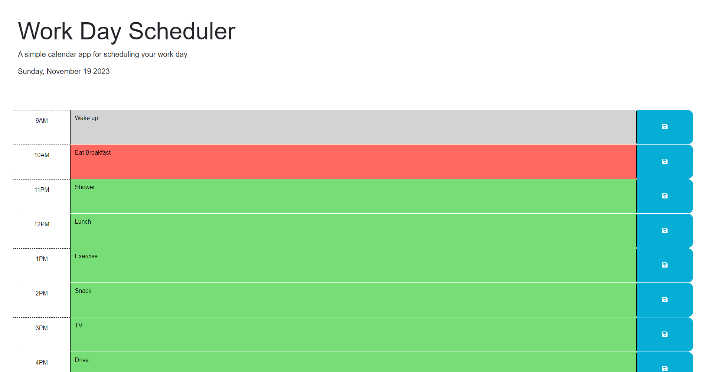

# Module5Challenge

This is a web application using jQuery.
It is a day planner that is color coded by past, present, and future and updates in real time.
Users can enter in their own events to save and it is saved to broswer local storage for future viewing.
Each time block takes up one hour

https://gerlach0130.github.io/Module5Challenge/

